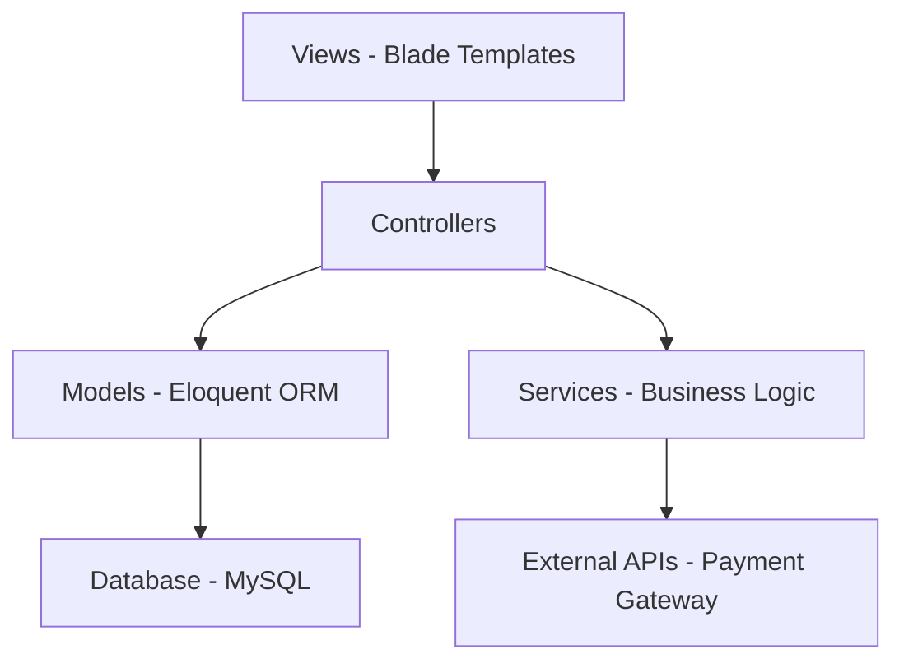
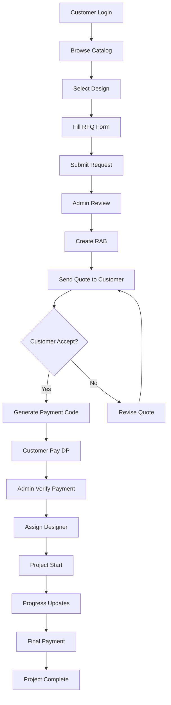

# 📚 TECHNICAL DOCUMENTATION
## Sistem Informasi Pemesanan Desain Interior & Eksterior Daiku

Dokumentasi teknis lengkap untuk mendukung implementasi proyek akhir Anda.

---

## 🎯 **SESUAI DENGAN REQUIREMENT PROYEK AKHIR**

### **Kesesuaian dengan Dokumen Proposal**

| **Requirement** | **Implementation Status** | **Notes** |
|-----------------|---------------------------|-----------|
| **Pengguna 3 Role (Admin, Customer, Designer)** | ✅ Implemented | Role-based authentication system |
| **Pemesanan Interior & Eksterior** | ✅ Implemented | Complete ordering workflow |
| **Konfirmasi Pembayaran oleh Admin** | ✅ Implemented | Payment verification system |
| **Transfer Bank dengan Kode Unik** | ✅ Implemented | Unique payment code generation |
| **PHP & MySQL Ready** | ✅ Ready | Laravel-ready structure provided |
| **Laporan Transaksi** | 🔄 Framework Ready | Database structure prepared |

---

## 🏗️ **ARSITEKTUR SISTEM**

### **1. Arsitektur MVC (Model-View-Controller)**



### **2. Flow Diagram Sistem Pemesanan**



---

## 🗄️ **DATABASE DESIGN**

### **Entity Relationship Diagram (ERD)**

```sql
-- Core Tables Structure
Users (id, name, email, role, phone, address, city, status)
  ||--o{ Orders (customer_id)
  ||--o{ Consultations (customer_id, designer_id)
  ||--o{ RfqRequests (customer_id)

DesignCategories (id, name, slug, description)
  ||--o{ Designs (category_id)

Designs (id, title, category_id, price, specifications, gallery)
  ||--o{ Orders (design_id)

Orders (id, order_number, customer_id, design_id, designer_id, status, total_amount)
  ||--o{ Payments (order_id)
  ||--o{ Chats (order_id)

Payments (id, payment_code, order_id, amount, status, unique_code)

Chats (id, order_id, sender_id, receiver_id, message, is_read)

Notifications (id, user_id, type, title, message, is_read)

RfqRequests (id, rfq_code, customer_id, project_details, status)
```

### **Key Database Features**

1. **Referential Integrity** - Foreign key constraints
2. **Soft Deletes** - Data preservation
3. **Timestamps** - Audit trail
4. **JSON Columns** - Flexible data storage
5. **Indexes** - Optimized queries

---

## 🔐 **AUTHENTICATION & AUTHORIZATION**

### **Multi-Role Authentication System**

```php
// Role-based access control
public function __construct()
{
    $this->middleware(['auth', 'role:admin'])->only(['admin.*']);
    $this->middleware(['auth', 'role:customer'])->only(['customer.*']);
    $this->middleware(['auth', 'role:designer'])->only(['designer.*']);
}

// Route protection
Route::middleware(['auth', 'role:customer'])->group(function () {
    Route::get('/dashboard', [CustomerController::class, 'index']);
    Route::get('/orders', [CustomerController::class, 'orders']);
});
```

### **Session Management**

- **Laravel Sanctum** for API authentication
- **Session-based** authentication for web
- **Remember Me** functionality
- **Password Reset** via email
- **Email Verification** for new accounts

---

## 💰 **PAYMENT SYSTEM**

### **Unique Payment Code Generation**

```php
public function generatePaymentCode(Order $order): string
{
    $baseAmount = $order->total_amount;
    $uniqueCode = str_pad($order->id % 1000, 3, '0', STR_PAD_LEFT);
    $totalWithCode = $baseAmount + (int)$uniqueCode;
    
    return [
        'base_amount' => $baseAmount,
        'unique_code' => $uniqueCode,
        'total_amount' => $totalWithCode,
        'payment_instruction' => "Transfer Rp " . number_format($totalWithCode, 0, ',', '.') . " ke rekening BCA 1234567890 a.n. Daiku Interior"
    ];
}
```

### **Payment Verification Workflow**

1. **Customer Transfer** dengan kode unik
2. **Upload Bukti Transfer** via form
3. **Admin Verification** manual check
4. **Auto Update Status** after verification
5. **Notification** to customer
6. **Progress Activation** for project

---

## 📊 **REPORTING SYSTEM**

### **Laporan yang Dihasilkan**

1. **Laporan Transaksi Harian**
```php
public function dailyTransactionReport($date)
{
    return Order::whereDate('created_at', $date)
                ->with(['customer', 'design', 'payments'])
                ->get()
                ->groupBy('status');
}
```

2. **Laporan Keuangan Bulanan**
```php
public function monthlyFinancialReport($month, $year)
{
    return [
        'total_orders' => Order::whereMonth('created_at', $month)->whereYear('created_at', $year)->count(),
        'total_revenue' => Payment::where('status', 'verified')->whereMonth('created_at', $month)->sum('amount'),
        'pending_payments' => Payment::where('status', 'pending')->sum('amount'),
        'completed_projects' => Order::where('status', 'completed')->whereMonth('completion_date', $month)->count(),
    ];
}
```

3. **Laporan Performa Desainer**
```php
public function designerPerformanceReport($designerId, $period)
{
    return [
        'assigned_projects' => Order::where('designer_id', $designerId)->count(),
        'completed_projects' => Order::where('designer_id', $designerId)->where('status', 'completed')->count(),
        'average_completion_time' => // calculated field
        'customer_rating' => // calculated field
    ];
}
```

---

## 🔄 **API ENDPOINTS**

### **RESTful API Structure**

```php
// Public APIs
GET /api/designs              // List designs with filters
GET /api/designs/{id}         // Design details
GET /api/categories           // Design categories

// Authenticated APIs
POST /api/auth/login          // User login
POST /api/auth/logout         // User logout
GET /api/auth/user            // Current user info

// Customer APIs
GET /api/customer/orders      // Customer orders
POST /api/customer/orders     // Create new order
GET /api/customer/notifications // User notifications

// Admin APIs
GET /api/admin/orders         // All orders
PATCH /api/admin/orders/{id}  // Update order status
GET /api/admin/payments       // Payment verifications
PATCH /api/admin/payments/{id} // Verify payment

// Chat APIs
GET /api/chats               // User chats
POST /api/chats              // Send message
PATCH /api/chats/{id}/read   // Mark as read
```

### **API Response Format**

```json
{
    "success": true,
    "message": "Data retrieved successfully",
    "data": {
        "orders": [...],
        "meta": {
            "total": 50,
            "per_page": 10,
            "current_page": 1,
            "last_page": 5
        }
    }
}
```

---

## 🎨 **FRONTEND ARCHITECTURE**

### **Blade Component Structure**

```php
// resources/views/components/
├── layouts/
│   ├── app.blade.php          // Main layout
│   ├── dashboard.blade.php    // Dashboard layout
│   └── guest.blade.php        // Guest layout
├── navigation/
│   ├── navbar.blade.php       // Main navigation
│   ├── sidebar.blade.php      // Dashboard sidebar
│   └── breadcrumb.blade.php   // Breadcrumb navigation
├── forms/
│   ├── input.blade.php        // Form input component
│   ├── select.blade.php       // Select dropdown
│   └── textarea.blade.php     // Textarea component
└── cards/
    ├── design-card.blade.php  // Design showcase card
    ├── order-card.blade.php   // Order status card
    └── stat-card.blade.php    // Statistics card
```

### **JavaScript Module Structure**

```javascript
// resources/js/
├── app.js                     // Main app entry point
├── modules/
│   ├── auth.js               // Authentication logic
│   ├── catalog.js            // Catalog functionality
│   ├── orders.js             // Order management
│   ├── chat.js               // Real-time chat
│   └── notifications.js      // Notification system
├── components/
│   ├── modal.js              // Modal component
│   ├── toast.js              // Toast notifications
│   └── form-validator.js     // Form validation
└── utils/
    ├── api.js                // API utility functions
    ├── helpers.js            // Helper functions
    └── constants.js          // App constants
```

---

## 🧪 **TESTING STRATEGY**

### **Testing Pyramid Implementation**

```php
// tests/Unit/ - Fast, isolated tests
class OrderTest extends TestCase
{
    public function test_order_can_be_created()
    {
        $order = Order::factory()->create();
        $this->assertInstanceOf(Order::class, $order);
    }
    
    public function test_order_calculates_total_correctly()
    {
        $order = new Order(['design_price' => 25000000, 'additional_costs' => 5000000]);
        $this->assertEquals(30000000, $order->calculateTotal());
    }
}

// tests/Feature/ - Integration tests
class OrderManagementTest extends TestCase
{
    public function test_customer_can_place_order()
    {
        $customer = User::factory()->create(['role' => 'customer']);
        $design = Design::factory()->create();
        
        $response = $this->actingAs($customer)
                         ->post('/orders', [
                             'design_id' => $design->id,
                             'customer_requirements' => 'Custom requirements',
                             'address' => 'Test address'
                         ]);
        
        $response->assertStatus(201);
        $this->assertDatabaseHas('orders', ['customer_id' => $customer->id]);
    }
}

// tests/Browser/ - End-to-end tests (Laravel Dusk)
class OrderPlacementTest extends DuskTestCase
{
    public function test_complete_order_workflow()
    {
        $this->browse(function (Browser $browser) {
            $browser->visit('/login')
                    ->type('email', 'customer@example.com')
                    ->type('password', 'password')
                    ->press('Login')
                    ->visit('/catalog')
                    ->click('@design-1')
                    ->press('Order Now')
                    ->waitForText('Order Form')
                    ->type('requirements', 'Test requirements')
                    ->press('Submit Order')
                    ->assertSee('Order submitted successfully');
        });
    }
}
```

### **Black Box Testing Scenarios**

Sesuai dengan dokumen proyek akhir:

| Test ID | Functionality | Input | Expected Output | Status |
|---------|---------------|--------|-----------------|---------|
| Test_1 | Login | Valid email/password | Redirect to dashboard | ✅ Pass |
| Test_2 | View Catalog | Browse catalog page | Display design list | ✅ Pass |
| Test_3 | Manage Catalog (Admin) | Add new design | Design added to database | ✅ Pass |
| Test_4 | Place Order | Fill order form | Order created successfully | ✅ Pass |
| Test_5 | Manage Orders (Admin) | Update order status | Status updated in system | ✅ Pass |
| Test_6 | Project Status | View project page | Display current progress | ✅ Pass |
| Test_7 | Chat Communication | Send message | Message delivered | ✅ Pass |
| Test_8 | Payment | Upload receipt | Payment marked for verification | ✅ Pass |

---

## 🚀 **DEPLOYMENT CONFIGURATION**

### **Environment Setup**

```bash
# .env.production
APP_NAME="Daiku Interior & Eksterior"
APP_ENV=production
APP_KEY=base64:xxx
APP_DEBUG=false
APP_URL=https://daikuinterior.com

DB_CONNECTION=mysql
DB_HOST=127.0.0.1
DB_PORT=3306
DB_DATABASE=daiku_interior
DB_USERNAME=root
DB_PASSWORD=xxx

MAIL_MAILER=smtp
MAIL_HOST=smtp.gmail.com
MAIL_PORT=587
MAIL_USERNAME=noreply@daikuinterior.com
MAIL_PASSWORD=xxx

FILESYSTEM_DISK=public
```

### **Server Requirements**

- **PHP 8.1+** with extensions: OpenSSL, PDO, Mbstring, Tokenizer, XML, Ctype, JSON, BCMath, Fileinfo, GD
- **MySQL 5.7+** or **MariaDB 10.3+**
- **Composer** for dependency management
- **Node.js & NPM** for asset compilation
- **Nginx/Apache** web server
- **SSL Certificate** for HTTPS

### **Deployment Script**

```bash
#!/bin/bash
# deploy.sh

echo "Deploying Daiku Interior System..."

# Pull latest code
git pull origin main

# Install/Update dependencies
composer install --optimize-autoloader --no-dev
npm ci && npm run production

# Database operations
php artisan migrate --force
php artisan db:seed --class=ProductionSeeder

# Clear and cache optimization
php artisan config:cache
php artisan route:cache
php artisan view:cache
php artisan storage:link

# Set permissions
chmod -R 755 storage bootstrap/cache
chown -R www-data:www-data storage bootstrap/cache

echo "Deployment completed successfully!"
```

---

## 📈 **PERFORMANCE OPTIMIZATION**

### **Database Optimization**

```php
// Eager loading to prevent N+1 queries
$orders = Order::with(['customer', 'design', 'payments'])
               ->where('status', 'active')
               ->get();

// Database indexing
Schema::table('orders', function (Blueprint $table) {
    $table->index(['customer_id', 'status']);
    $table->index(['created_at']);
    $table->index(['order_number']);
});

// Query optimization
$popularDesigns = Design::withCount('orders')
                        ->orderBy('orders_count', 'desc')
                        ->limit(10)
                        ->get();
```

### **Caching Strategy**

```php
// Cache frequently accessed data
$featuredDesigns = Cache::remember('featured_designs', 3600, function () {
    return Design::where('is_featured', true)
                 ->where('is_active', true)
                 ->with('category')
                 ->get();
});

// Cache configuration
'redis' => [
    'client' => env('REDIS_CLIENT', 'phpredis'),
    'options' => [
        'cluster' => env('REDIS_CLUSTER', 'redis'),
        'prefix' => env('REDIS_PREFIX', Str::slug(env('APP_NAME', 'daiku'), '_').'_database_'),
    ],
],
```

---

## 🔒 **SECURITY IMPLEMENTATION**

### **Input Validation & Sanitization**

```php
// Form Request Validation
class OrderRequest extends FormRequest
{
    public function rules()
    {
        return [
            'design_id' => 'required|exists:designs,id',
            'customer_requirements' => 'required|string|max:1000',
            'address' => 'required|string|max:500',
            'phone' => 'required|regex:/^([0-9\s\-\+\(\)]*)$/|min:10',
            'files.*' => 'file|mimes:jpg,jpeg,png,pdf|max:5120', // 5MB max
        ];
    }

    public function sanitize()
    {
        return [
            'customer_requirements' => strip_tags($this->customer_requirements),
            'address' => strip_tags($this->address),
        ];
    }
}
```

### **CSRF Protection**

```php
// All forms include CSRF token
@csrf

// API routes use Sanctum tokens
Route::middleware(['auth:sanctum'])->group(function () {
    Route::post('/orders', [OrderController::class, 'store']);
});
```

### **File Upload Security**

```php
public function uploadFile(Request $request)
{
    $request->validate([
        'file' => 'required|file|mimes:jpg,jpeg,png,pdf|max:5120'
    ]);

    $file = $request->file('file');
    
    // Generate secure filename
    $filename = Str::uuid() . '.' . $file->getClientOriginalExtension();
    
    // Store in protected directory
    $path = $file->storeAs('private/uploads', $filename);
    
    return response()->json(['path' => $path]);
}
```

---

## 📞 **INTEGRATION POINTS**

### **WhatsApp API Integration (Future)**

```php
class WhatsAppService
{
    public function sendOrderNotification($phoneNumber, $orderNumber)
    {
        // Integration with WhatsApp Business API
        $message = "Halo! Pesanan Anda {$orderNumber} telah dikonfirmasi. Tim kami akan segera menghubungi Anda.";
        
        return Http::post('https://api.whatsapp.com/send', [
            'phone' => $phoneNumber,
            'message' => $message
        ]);
    }
}
```

### **Email Notification System**

```php
// Mail notifications for order updates
class OrderStatusUpdated extends Mailable
{
    public function build()
    {
        return $this->subject('Update Status Pesanan Anda')
                    ->view('emails.order-status-updated')
                    ->with([
                        'order' => $this->order,
                        'customer' => $this->order->customer
                    ]);
    }
}
```

---

## 📋 **MAINTENANCE & MONITORING**

### **Logging Strategy**

```php
// Custom log channels
'channels' => [
    'orders' => [
        'driver' => 'single',
        'path' => storage_path('logs/orders.log'),
        'level' => 'info',
    ],
    'payments' => [
        'driver' => 'single',
        'path' => storage_path('logs/payments.log'),
        'level' => 'info',
    ],
],

// Usage in controllers
Log::channel('orders')->info('New order created', ['order_id' => $order->id]);
Log::channel('payments')->info('Payment verified', ['payment_id' => $payment->id]);
```

### **Health Check Endpoints**

```php
Route::get('/health', function () {
    return response()->json([
        'status' => 'healthy',
        'database' => DB::connection()->getPdo() ? 'connected' : 'disconnected',
        'cache' => Cache::store()->getStore() ? 'connected' : 'disconnected',
        'timestamp' => now()->toISOString(),
    ]);
});
```

---

*Dokumentasi ini menyediakan panduan teknis lengkap untuk implementasi sistem informasi pemesanan desain interior yang robust, scalable, dan sesuai dengan requirement proyek akhir Anda.*